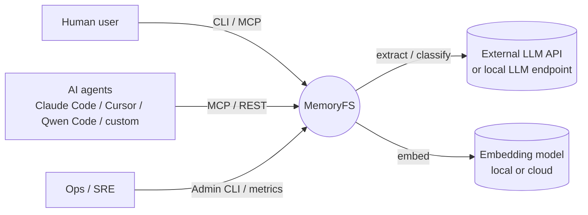
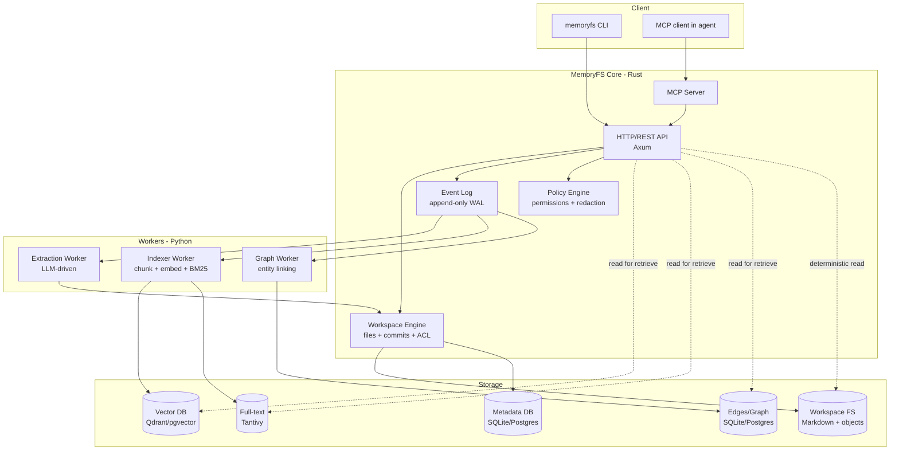
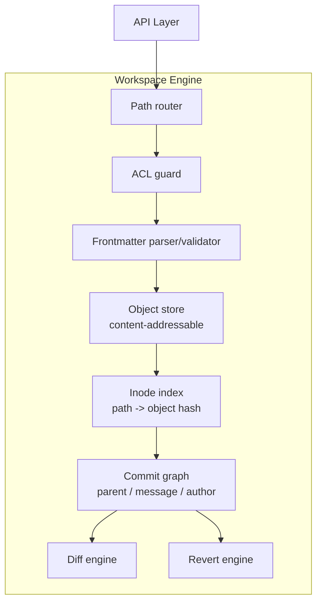
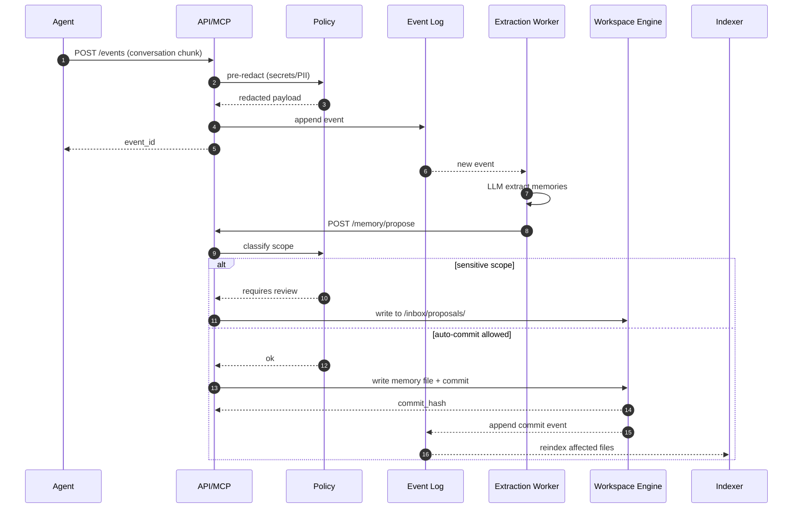
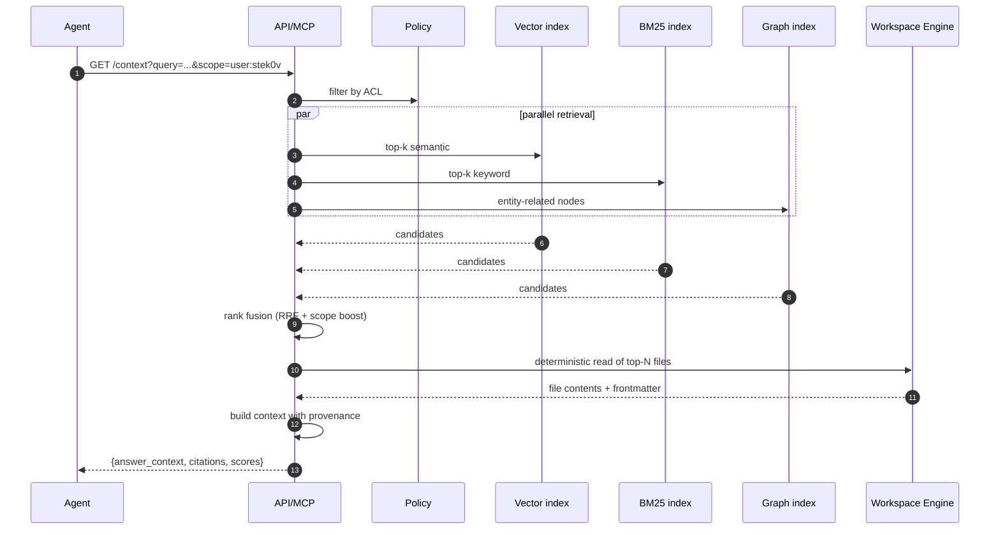
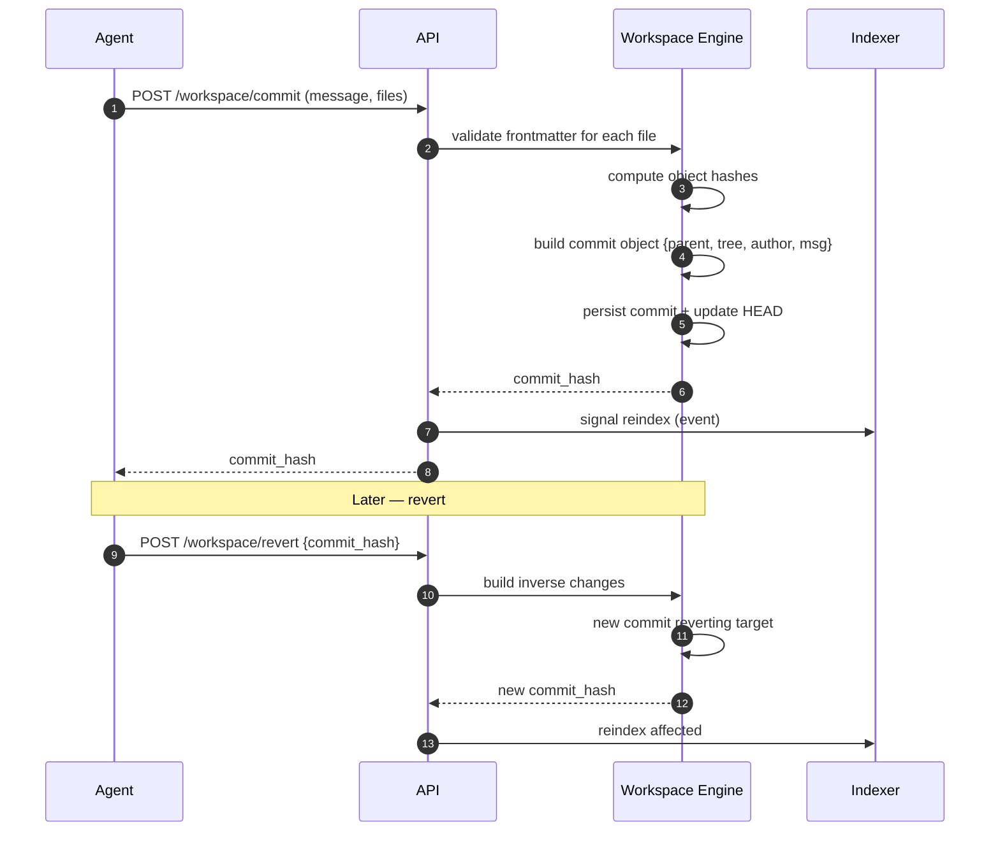
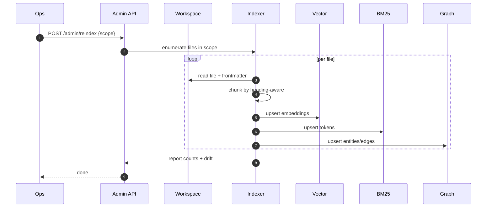
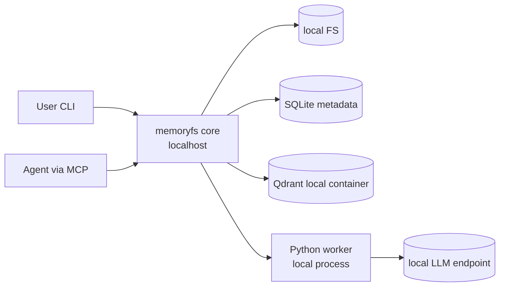
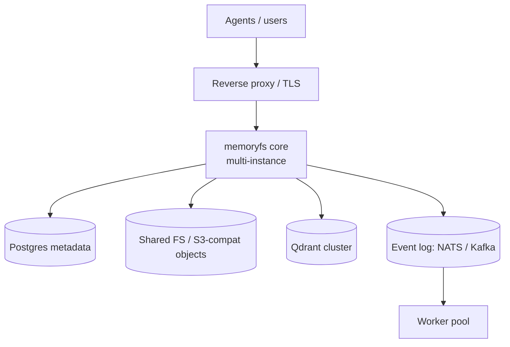

# 01 — Архитектура MemoryFS

## 1. Архитектурные принципы

1. **Truth before retrieval.** Источник истины — Markdown-файлы. Индексы — производные.
2. **Append-only, never overwrite.** Изменение факта = новая запись + supersede.
3. **Provenance as data, not metadata.** Источник, run_id, commit, confidence — обязательные поля, валидируются схемой.
4. **Explicit commit boundaries.** Ни один агент не пишет в workspace без явного commit-события.
5. **Indexes are disposable.** Любой индекс должен полностью реконструироваться из workspace + event log.
6. **Permissions enforced at API, not at filesystem.** ОС-permissions — defense in depth, не основной механизм.
7. **Deterministic final read.** Retrieval даёт кандидатов; ответ строится на детерминированном чтении файлов.
8. **Plug-in by contract.** Embedder, LLM-extractor, graph-store, vector-store — за интерфейсами.

## 2. C4: Уровень 1 — Context



## 3. C4: Уровень 2 — Containers



## 4. C4: Уровень 3 — Component (Workspace Engine)



## 5. Поток: Запись памяти (write path)



## 6. Поток: Чтение / Recall (read path)



## 7. Поток: Commit / Revert



## 8. Поток: Reindex (rebuild from truth)



## 9. Структура директорий workspace

```text
/workspaces/<workspace_id>/
├── .memoryfs/
│   ├── config.yaml              # workspace config
│   ├── HEAD                     # current commit hash
│   ├── refs/                    # named refs (main, branches)
│   ├── objects/                 # content-addressable blobs
│   ├── commits/                 # commit objects
│   ├── policy.yaml              # memory policies
│   ├── schema/                  # JSON schemas per type
│   └── audit.log                # append-only audit
│
├── memory/
│   ├── users/<user_id>/
│   │   ├── profile.md
│   │   ├── preferences.md
│   │   └── history/<ULID>.md
│   ├── agents/<agent_id>/
│   │   ├── identity.md
│   │   └── learnings/<ULID>.md
│   ├── sessions/<session_id>/
│   ├── projects/<project_id>/
│   └── org/
│
├── conversations/
│   └── <YYYY>/<MM>/<DD>/<conv_id>.md
│
├── runs/
│   └── <run_id>/
│       ├── prompt.md
│       ├── tool_calls.md
│       ├── stdout.md
│       ├── stderr.md
│       ├── result.md
│       ├── metadata.md
│       ├── memory_patch.md
│       └── artifacts/
│
├── decisions/
│   └── adr-<NNNN>-<slug>.md
│
├── entities/
│   ├── people/<entity_id>.md
│   ├── projects/<entity_id>.md
│   ├── tools/<entity_id>.md
│   └── concepts/<entity_id>.md
│
├── inbox/
│   ├── proposals/               # awaiting review
│   └── conflicts/               # superseding to confirm
│
└── archive/                     # superseded / deprecated
```

## 10. Слои хранения

| Слой | Технология | Назначение | Перестраиваемый? |
| ------ | ----------- | ------------ | ------------------ |
| Markdown FS | filesystem + объекты по хешу | Источник истины, content-addressable | — (canonical) |
| Metadata DB | SQLite (single-node) / Postgres (server) | Inode index, ACL cache, commit graph | Да, из FS |
| Vector index | Qdrant (рекоменд.) или pgvector | Семантический recall | Да |
| Full-text index | Tantivy (embedded) или Meilisearch | BM25 / keyword | Да |
| Graph store | Postgres-таблица `edges` (MVP) → Kuzu | Entity-linking, multi-hop | Да |
| Event log | append-only file + offset-index | Очередь событий для воркеров | — (canonical для очереди) |
| Audit log | append-only file | Compliance / debugging | — (canonical для аудита) |

**Правило**: если данные есть только в индексе и нет в `workspace + event log + audit log` —
это баг, индекс **не** источник истины ни для чего.

## 11. Безопасность — слои защиты

```mermaid
flowchart LR
    INP[Input from agent/user] --> SAN[1. Sanitizer<br/>strip system instructions]
    SAN --> RED[2. Redactor<br/>regex + entropy + denylist]
    RED --> POL[3. Policy engine<br/>scope rules]
    POL --> EXT[4. LLM extractor<br/>contract-bound output]
    EXT --> SCAN[5. Post-scan<br/>secrets after extraction]
    SCAN --> REV[6. Review queue<br/>for sensitive scopes]
    REV --> ACL[7. ACL guard<br/>at write]
    ACL --> WS[Workspace]
    WS --> AUDIT[8. Audit log]
```



Каждый слой имеет независимые тесты (см. `06-testing-strategy.md`).

## 12. Permissions модель

- **Subjects**: `user:<id>`, `agent:<id>`, `group:<id>`, `role:<name>`, `owner`, `anonymous`.
- **Resources**: путь в workspace (с поддержкой glob: `/memory/users/stek0v/**`).
- **Actions**: `read`, `write`, `commit`, `propose`, `review`, `revert`, `delete`, `admin`.
- **Decision rule**: `deny` побеждает `allow`; default — `deny`.
- **ACL хранится** в `.memoryfs/policy.yaml` + опционально per-file overrides в frontmatter.

Пример:

```yaml
# .memoryfs/policy.yaml
default_deny: true
rules:
  - subject: "user:stek0v"
    resource: "/memory/users/stek0v/**"
    actions: ["read", "write", "commit", "revert"]
  - subject: "agent:valeria"
    resource: "/memory/users/stek0v/**"
    actions: ["read", "propose"]
  - subject: "group:reviewers"
    resource: "/inbox/proposals/**"
    actions: ["read", "review", "commit"]
```

## 13. Deployment — топологии

### 13.1 Local single-user (MVP target)



### 13.2 Team server (Phase 5+)



## 14. Контракты между компонентами

### 14.1 API ↔ Workspace Engine

```rust
trait WorkspaceEngine {
    fn read(&self, path: &Path, ctx: &AuthCtx) -> Result<File>;
    fn write(&self, path: &Path, content: &[u8], fm: Frontmatter, ctx: &AuthCtx) -> Result<ObjectHash>;
    fn commit(&self, msg: &str, paths: &[Path], ctx: &AuthCtx) -> Result<CommitHash>;
    fn revert(&self, commit: CommitHash, ctx: &AuthCtx) -> Result<CommitHash>;
    fn diff(&self, from: CommitHash, to: CommitHash) -> Result<Diff>;
    fn log(&self, path: Option<&Path>, limit: usize) -> Result<Vec<CommitMeta>>;
    fn list(&self, path: &Path, ctx: &AuthCtx) -> Result<Vec<DirEntry>>;
}
```

### 14.2 Indexer ↔ stores

```python
class Indexer:
    def index_file(self, file: WorkspaceFile, commit: str) -> IndexResult: ...
    def remove_file(self, path: str) -> None: ...
    def reindex_scope(self, scope_glob: str) -> ReindexReport: ...
```

### 14.3 Extraction worker

```python
class ExtractionWorker:
    def extract(self, event: ConversationEvent, ctx: ExtractionContext) -> List[MemoryProposal]: ...
```

`MemoryProposal` всегда включает `confidence`, `source_span`, `entities`, `scope`, `type`.
Воркер **никогда** не пишет в workspace напрямую — только через `POST /memory/propose`.

## 15. Observability

Обязательно с Phase 1:

- **Metrics** (Prometheus-формат): RPS, p50/p95/p99 на read/write/commit/recall; queue depth;
  index drift; redaction hits; review-queue size.
- **Tracing** (OpenTelemetry): trace per request; spans на каждый слой (API → policy → engine → store).
- **Structured logs** (JSON): обязательные поля `trace_id`, `workspace_id`, `subject`, `action`, `resource`, `result`.
- **Audit events** (отдельный лог): все write/commit/revert/review events, immutable.

## 16. Что считаем "production-ready"

Не входит в MVP, но фиксируем DoD для зрелости:

- p95 read < 50ms на workspace до 100k файлов.
- p95 recall < 300ms (вкл. fusion).
- Reindex 100k файлов < 30 минут.
- Zero data loss при kill -9 на любом этапе (WAL recovery).
- Все sensitive-write события → audit log без потерь.
- Coverage > 80% на core (Rust), > 70% на workers (Python).
- Adversarial-suite: 100% redaction для известных шаблонов секретов.
