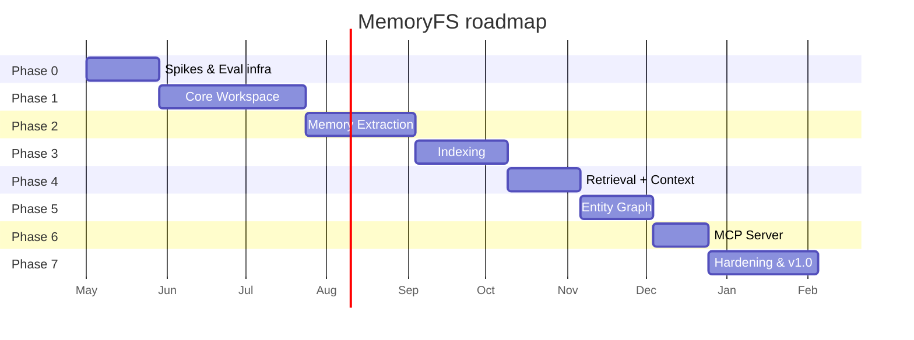

# 07 — Дорожная карта

Документ синхронизирован с `04-tasks-dod.md` (фаза → задачи) и `00-analysis.md` (риски, допущения).

## 1. Высокоуровневая последовательность

Длительности — оценочные при команде 2-3 senior eng + 1 ML eng + 0.5 SRE. Корректируются после Phase 0.

## 2. Phase 0 — Foundations & Spikes (4 недели)

**Цель**: убрать архитектурные unknowns до реальной разработки.

**Ключевые задачи**: 0.1 - 0.6 из `04-tasks-dod.md`.

**Deliverables**:

- Бенч-результаты Markdown-FS на масштабе → решение по object layout.
- Прототипы Rust↔Python IPC → выбор механизма (ADR-003).
- Eval-инфраструктура retrieval + extraction зафиксирована.
- JSON Schemas v1 финализированы.
- Killer-demo workspace.

**Exit-критерии**:

1. Все 6 задач Phase 0 закрыты по DoD.
2. Eval-runner работает в CI (baseline пока пустой — наполнится в Phase 2-3).
3. Schemas v1 одобрены архитектором + 2 ревьюерами.
4. Все ключевые ADR (001-005) записаны и одобрены.

**Ключевые риски фазы**:

- Слишком долгий спайк (соблазн перфекционировать). Митигация: timebox 2 недели на каждый спайк.
- Eval-разметка занимает много времени. Митигация: 100 кейсов ручной разметки + 100 синтетических.

**Killer demo на конце фазы**: нет (только инфраструктура).

---

## 3. Phase 1 — Core Workspace (8 недель)

**Цель**: рабочий CLI + REST для read/write/commit/revert/log + ACL + secret pre-redaction. Без extraction и indexing.

**Ключевые задачи**: 1.1 - 1.10.

**Deliverables**:

- Object store + frontmatter parser + commit graph + ACL.
- REST API (subset) + CLI (subset).
- Pre-redaction для secrets.
- Audit log + observability v1.
- Getting-started doc.

**Exit-критерии** (повтор из `04-tasks-dod.md`):

1. CLI делает init/write/commit/log/revert на 100k файлов без падений.
2. ACL покрыт тестами + adversarial-suite.
3. Secret pre-redaction работает по eval-набору (100% на adversarial, ≤ 2% FP).
4. p95 read < 50ms на 10k workspace (бенч).
5. Killer-demo workspace проходит smoke-test.

**Ключевые P0 cornercases закрыты**: 1.1, 1.5, 5.1, 5.3, 5.4, 5.7, 5.8, 6.3, 6.4, 8.1.

**Демо**: разработчик инициализирует workspace, пишет несколько memory-файлов вручную
(без extraction), коммитит, делает revert; ACL отрабатывает; секрет в файле блокируется.

**Риски фазы**:

- ACL-сложность недооценена. Митигация: adversarial suite в Phase 0.
- Conflict-handling concurrent commits. Митигация: тест 1.1 как gating.

---

## 4. Phase 2 — Memory Extraction (6 недель)

**Цель**: автоматическая извлечение памяти из conversations + review-flow.

**Ключевые задачи**: 2.1 - 2.7.

**Deliverables**:

- Event log + worker bus.
- Extraction prompt + Python worker.
- Policy engine + inbox + review API.
- Post-extraction secret scan.
- Supersede engine.

**Exit-критерии**:

1. Eval extraction F1 ≥ 0.7 на baseline-наборе.
2. Sensitive scopes никогда не auto-commit'ятся (adversarial-suite зелёная).
3. Worker outage не теряет события.
4. Review-flow проходит e2e на killer-demo.

**P1 cornercases закрыты**: 2.1, 2.2, 2.3, 2.6, 5.3 (extended), 9.1, 9.2.

**Демо**: пользователь ведёт диалог с агентом, после диалога видит inbox с предлагаемыми
воспоминаниями, ревьюит, утверждает; sensitive вещи сами идут в inbox,
нечувствительные — auto-commit с возможностью revert.

**Риски фазы**:

- LLM-extraction quality ниже целевого F1. Митигация: prompt итерация, contract-tests,
  fall-back на rule-based для частотных паттернов.
- Утечка секретов. Митигация: post-scan + redaction tests.

---

## 5. Phase 3 — Indexing (5 недель)

**Цель**: vector + BM25 индексация → быстрый recall.

**Ключевые задачи**: 3.1 - 3.6.

**Deliverables**:

- Heading-aware chunker.
- Embedding pipeline + cache.
- Qdrant adapter + Tantivy adapter.
- Indexer worker (event-driven).
- Reindex API.

**Exit-критерии**:

1. NDCG@10 на eval ≥ baseline + 10% по сравнению с only-vector.
2. Drift между FS и индексами = 0 на killer-demo.
3. Reindex восстанавливает индексы корректно.
4. Index 100k файлов < 30 минут.

**P1/P2 cornercases закрыты**: 1.2, 1.3, 4.6, 9.5, 9.6.

**Демо**: workspace из killer-demo с 1000 памятей; recall по запросу возвращает топ-8 с правильным cite + scoring breakdown.

**Риски фазы**:

- Embedding model выбор → vendor lock. Митигация: pluggable embedder + двойной индекс на migration.
- Indexer лагает. Митигация: queue depth metrics + degraded-mode response.

---

## 6. Phase 4 — Retrieval + Context API (4 недели)

**Цель**: production-ready `/v1/context` для агентов.

**Ключевые задачи**: 4.1 - 4.4.

**Deliverables**:

- Multi-signal fusion (RRF + scope/recency boost).
- ACL-after-retrieve.
- `/v1/context` endpoint.
- Deterministic file read.

**Exit-критерии**:

1. p95 recall < 300ms на 100k workspace.
2. Eval NDCG@10 ≥ target.
3. ACL adversarial-suite зелёная (включая cross-tenant).

**P2 cornercases закрыты**: 1.4, 4.4, 5.4 (extended), 10.1, 10.2.

**Демо**: агент через REST вызывает `/v1/context` с query "почему мы выбрали Qdrant?" —
получает 3 памяти с cite, source_file, source_commit, scores. Файлы читаются актуальные
(после change), индекс не врёт.

---

## 7. Phase 5 — Entity Graph (4 недели)

**Цель**: entity-aware retrieval + entity API.

**Ключевые задачи**: 5.1 - 5.4.

**Deliverables**:

- Entities + edges store (SQL-таблица).
- NER + entity linking в extraction.
- Entity-aware retrieval.
- Entity REST API.

**Exit-критерии**:

1. Entity dedupe rate ≥ 80% на eval entity-set.
2. Multi-hop ("какие проекты связаны с пользователем?") работает.
3. NDCG@10 не отрицательный (entity не ухудшает; идеально — улучшает на 5%+).

**P2 cornercases закрыты**: 4.5, 9.3, 9.4 (model id tracking).

**Демо**: пользователь спрашивает "что Stek0v делал в проекте Picoclaw в апреле?" —
entity-aware retrieval возвращает связанные памяти/runs/decisions.

**Риски фазы**:

- Entity dedupe сложен. Митигация: confidence threshold + manual merge tooling.
- Graph traversal медленный. Митигация: depth=2 default + weight pruning.

---

## 8. Phase 6 — MCP Server (3 недели)

**Цель**: production MCP integration для Claude Code / Cursor / Qwen Code.

**Ключевые задачи**: 6.1 - 6.3.

**Deliverables**:

- MCP server (stdio + sse).
- Все 17 tools.
- Agent token authn/authz.

**Exit-критерии**:

1. Demo в Claude Code и Cursor: реальный workflow (recall + write + commit).
2. Tool latency p95 < 200ms.
3. Cross-workspace попытки заблокированы (adversarial).

**Демо**: разработчик в Cursor ставит MCP-плагин, агент через MCP читает память по проекту,
пишет run-record, предлагает memory updates, юзер ревьюит.

---

## 9. Phase 7 — Hardening & v1.0 (6 недель)

**Цель**: production-grade reliability + полная документация + v1.0 release.

**Ключевые задачи**: 7.1 - 7.5 + закрытие P3 cornercases.

**Deliverables**:

- Backup / restore.
- Migration runner (schema v1 → v2 etalon).
- Chaos suite зелёная.
- Performance hardening.
- Документация v1.0 (architecture / operations / integrations / security).

**Exit-критерии**:

1. Все SLO достигнуты (read p95 < 50ms, recall p95 < 300ms, reindex 100k < 30 мин).
2. Chaos suite: 0 data loss, корректный recovery на всех сценариях.
3. Coverage в floor.
4. Security scan: 0 critical, ≤ 5 high с планом.
5. Documentation drift = 0.
6. Pen-test report — критичные findings закрыты.

**P3 cornercases закрыты**: 4.3, 6.5, 11.1, 11.2, 11.3 (11.4 — explicit not supported в v1).

**v1.0 release**.

---

## 10. Параллельная работа vs последовательная

Что **можно** делать параллельно:

- Phase 0 (eval infra) и часть Phase 1 (object store, parser).
- В Phase 1: ACL и pre-redaction параллельно с object store (разные люди).
- В Phase 2: extraction worker и policy engine параллельно.
- Документация — всегда параллельно с разработкой (требование CC.4).

Что **нельзя**:

- Phase 3 индексация без Phase 2 extraction (нужны реальные memories для bench).
- Phase 4 retrieval без Phase 3 indexing.
- Phase 6 MCP без Phase 4 (recall — главный tool).

## 11. Команда и роли (минимально для MVP)

| Роль | Кол-во | Ответственность |
| ------ | -------- | ----------------- |
| Tech lead / архитектор | 1 | архитектура, ADR, ревью |
| Senior backend (Rust) | 1-2 | core workspace |
| Senior backend (Python) | 1 | workers, MCP |
| ML eng | 1 (50%) | extraction, retrieval, eval |
| SRE / platform | 0.5-1 | observability, chaos, deployment |
| QA | 0.5 | test infra, adversarial suites |
| Security owner | 0.25 | redaction, threat model, pen-test |
| Product / DevRel | 0.5 | docs, demos, integrations |

Полный комплект — Phase 1+. На Phase 0 — tech lead + 1 senior достаточно.

## 12. Ключевые отметки и go/no-go

| Дата (от старта) | Веха | Решение |
| ------------------ | ------ | --------- |
| +4w | Phase 0 done | Идти ли в Phase 1 как запланировано или пересмотреть scope |
| +12w | Phase 1 done | Public preview или продолжать internal |
| +18w | Phase 2 done | Eval baseline → если F1 < 0.6, корректируем product strategy |
| +23w | Phase 3 done | Public alpha с recall — открытый вопрос |
| +27w | Phase 4 done | Public alpha точно |
| +31w | Phase 5 done | Beta |
| +34w | Phase 6 done | Beta with MCP integrations |
| +40w | v1.0 | GA |

## 13. Out of scope для v1.0

См. `00-analysis.md` §6. Дополнительно:

- Federated workspaces.
- Cross-org sharing.
- Plugin SDK для community.
- Web UI / dashboard как отдельный продукт.
- Mobile-клиент.
- Auto-merge AI-conflict resolution.
- Distributed mode.

Эти фичи попадают в v1.x / v2.0 backlog в зависимости от спроса.

## 14. Что нужно решить **до** старта Phase 1

Блокирующие решения:

1. **Embedding модель по умолчанию** (для eval-baseline). Кандидаты: `text-embedding-3-small`,
   локальная (`bge-base`, `nomic-embed-text`). Решение фиксируется в ADR.
2. **LLM для extraction по умолчанию**: внешний API vs локальный. ADR.
3. **Vector store**: Qdrant vs pgvector. ADR-009.
4. **IPC механизм Rust↔Python**: после Phase 0 спайка. ADR-003.
5. **Token формат**: JWT vs opaque. ADR-006.
6. **Хост ОС поддержка**: Linux + macOS на v1.0; Windows — позже. Зафиксировано в README.

Все решения — оформляются как ADR в `08-adrs.md`.
